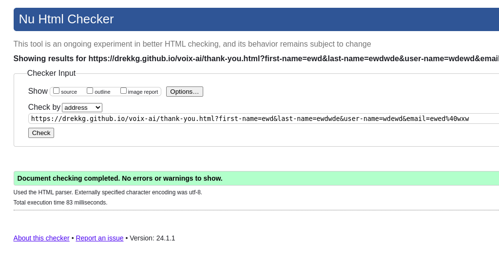
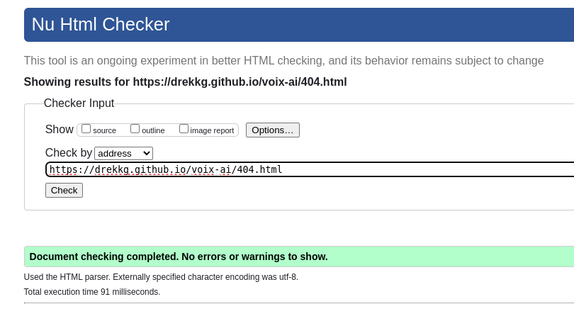

# Voix-ai
Voix-ai is a website designed to drive traffic to an A.I voice modelling service.
The website is aimed at content creators, whether it is somebody making YouTube videos, product promotional vidoes
or audio books - in fact anybody that needs audio narration.
After landing on the home page, the user would click on the link to the samples. After listening to the samples,
and being suitably impressed, they would then signup for a free account, which would acquaint the user with the functionality and usefulness of Voix-ai. Professional and frequent users would become monthly subscribers.

## Live Site 
Voix-ai deployed live on GitHub.
- https://drekkg.github.io/voix-ai/

## Repository
- A link to the Voix-ai repository.
https://github.com/Drekkg/voix-ai

## Author
Derek Garnett
## Version Control
GitHub was used as version control of the codebase for this project.

### Naming Convention
To make the intent of commits more obvious, I attempt to use the following prefix naming convention for my commits:
 - **doc** documentation based commits
 - **fix** bug fixes
 - **feat** new features
 - **maint** maintenance updates and changes

### Commits
I was working on my laptop and computer at work. I had  merge issues that I could not unwind so I ditched my first repository and started over, hence a large first commit.
 
## UX
I strove to create a sleek, easy to navigate website. Without a lot of wording on the landing page and a smoky image of a microphone. Invoking a recording studio or a Jazz club.
The focus being on audio quality.
The ultimate purpose of the website is to get the user to listen to the samples. 

### Colour choice
I chose blue for the header and footer, which has a comfortable, familiar feel. The text is mainly Aliceblue which contrasts nicely with the dark background and the blue, keeping everything accessible.
The orange button draws attention to itself, enticing the user to click and navigate to the samples page.

## Features
An outline of features the user can expect.
### Existing Features
- __Navigation Bar__
- The Nav Bar is identical on all three pages, making it easier for the user to traverse the website.
- It contains links to Home, samples and the Signup page.
- The Voix-ai logo is a clickable link back to the homepage.

- __Landing page__
- The landing page comprises an image of a microphone, overlaid with text briefly describing
how the software functions, what the user can expect and a pitch as to why the user 
would want to use our software. 

- __Navigation Button__
- The landing, Sign-up and Thank you page all contain a button that takes the user to the samples page.
- The button is a distinctive colour that draws attention to itself. 
- The aim is to get the user to hear the samples.

- __Footer__
- The footer is found on all pages, including the Thank you page.
- It contains logos that are links to websites and social media accounts that use our software. 

- __Samples Page__
- The Samples page contains four different samples of our voice modelling software.
- The audio is embedded in the website and only plays when clicked.
- An orange icon of a microphone adorns each sample, making it easier for the user to choose between samples.
- Each sample is labelled with the model and mode of voice it uses.
- Playback as well as volume is user defined.
- The samples are there to fascinate the user and compel them to sign up.

- __Sign Up Page__
- The Sign Up page contains a form so that the user can sign up for a free account.
- The form is responsive,  with a styled submit button underneath.
- Text below the sign up form informs the user about the benefits of signing up and also the benefits and price of subscribing.
- the user will be asked to submit their full name, create a username and submit their email address.
- After submission the user will be referred to a thank you page.
- The form checks that all input fields are filled out and a valid email address is supplied.

- __Thank You Page__
- After successful submission, the user is redirected to a thank you page.
- The Thank You page displays a message thanking the user for joining and instructing them to check their emails.
- The background image is a man giving the thumbs up sign. Meant to be lighthearted.
- The thank you page also contains the header and footer. 

__404 Not Found__
- Typing the URL incorrectly will take you to a custom 404 not found page.
- The user would simply click on the Voix-a.i header link to go back to the landing page.

### Future Features to come.
__Text Input Page__
- A feature to be added in the future will be a text input box. Which will accept text input from the user and turn it into a narrated audio. Live on the website.
 
 ## Testing
 - Voix-ai the website was tested on a variety of physical devices: Laptops, larger 27 inch monitors, various Android phones and Tablets. It also looked and performed as expected on a variety of browsers(Edge, Chrome, Firefox, Samsung browser). Responsiveness was tested in Google chrome using numerous emulated devices(Apple iphones, ipads, Google Phones and Samsung devices).
 ## Manual testing
 Manual testing included:
 - The Github deployed site was checked many times, mainly on mobile devices.
 - The site was called up and the landing page was checked for legibility and responsiveness.
 - The links in the header were clicked to ensure the appropriate page was opened. 
 - The sample link took me to the samples.html page. 
 - The signup link to signup.html.
 - The logo-link in the header also works on all pages and takes the user back to the landing page. 
 - The samples work and play in all browsers and on all tested devices. 
 - The sign up form works and requires valid input in all fields.
 - The email field requires a valid email address. 
 - After a successful sign up the thank you page is displayed. 
 - The "Click here for Samples" button didn't work after deployment, the problem was tracked to some invalid html and solved(More in Bugs section).

 ## HTML Validation
 The HTML was validated using NU HTML Validator.
### Index HTML
 
 The first pass failed because of some errors: trailing slashes, incorrectly nested divs.

### Samples HTML
 
 This file had similar problems with trailing slashes.

### Signup Html
 
 This file had similar problems with trailing slashes.

### Thank You
 

### 404 Not Found
 
 
 ## CSS Validation
The CSS styles file was validated using The W3C validation Service.

Checking the CSS file turned up no errors.

## Compatibility and Responsive Testing
The website was tested using dev tools and the following emulated and real devices:
| TOOL / Device                 | BROWSER     | OS         | SCREEN WIDTH  |
|-------------------------------|-------------|------------|---------------|
| Real phone: S20 Ultra         | Chrome 120  | android 13 | M  412 x 915  |
|             Hauwei p20        | Chrome 120  | android 11 | M  375 x 768  |
| Real laptop asus              | Firefox 121 | linux pop  | LG1920x1080   | 
| Dev tools emulator: pixel 7   | chrome 120  | android 13 | M  412 x 915  |
|                     iPhone 12 | firefox 121 |  iOs 14    | M  428 x 926  |
|           Samsung galaxy fold | Chrome 120  | android 12 | XS 280 x 653  |
|           Samsung galaxy s8   | firefox 121 | android 8  |  S 360 x 740  |
| Real tablet: samsung s6       | Chrome 118  | android 10 | L 1600 x 2560 |
| Real computer:  windows pc    | IE Edge 88  | windows 10 | XL 1920 x 964 |

## Bugs

I had many bugs dealing with alignment and typos which were quickly fixed during development. Other issues took longer to resolve. The most notable bugs were:

 __HTML Validation__
 The first pass through the HTML validator threw up an error as I had nested a button element inside an anchor element which is not valid HTML.
  After a bit of searching, I found the correct procedure on Stack Overflow and wrapped the button element in a form element.

   

 __404 on favicon image__
 - I kept seeing an error about the apple-touch-icon. I ended up adding an href to the file in my repository and the problem went away.

__Trailing Slashes__ 
- I had a lot of trailing slashes in my HTML. My HTML formatter for my IDE kept putting trailing slashes for meta tags, links, inputs, line breaks, images and more. This would cause me to fail validation again and again. I would remove them periodically to solve the problem, but I really need to use another formatter.

## Accessibility Testing
Voix-ai was tested for accessibility using Lighthouse.

__Accessibility Audit__

## Technologies Used
__Languages Used__
- HTML
- CSS

## Deployment
__Deployment on GitHub using GitHub Pages__
- From the GitHub dashboard, click on Repositories.  

- Select and click on the repo you want to deploy.

- Click on settings.

- On the left hand side scroll and click on Pages.

- Make sure "Source" is set to "Deploy from branch".
- On "Branch" Select "Main". Make sure the selected folder is set to "/root".

- Click Save.
- Go back to your repository.
- Scroll down and on the right hand side and click on Deployments.

 
- Under the heading "Active Deployments" you will find a link to your deployed site.

- Copy and paste the link in a browser to view your live site.

## Credits
- The footer and responsive menu in the header I re-used code from the "Love Running" project.
- Stack Overflow for bug fixing and feature implementation.
- My Mentor Maria Havlicek also suggested some minor code fixes on the samples page.
 
__Content__
- As the technology showcased on Voix-ai doesn't exist, the content was all self created.

__Media__
- Samples narrated by Richard Berry.
- Recorded by Derek Garnett.
- Photos from pexels.com
- Logos from fontawesome.com
- Fonts from Google Fonts.
- Colour palette from coolors.co

__Programs Used__
- GIMP image manipulation.
- Pro Writing Aid - spelling and grammar check.
- VS Code.
- Chrome 
- Chrome DevTools
- Fire Fox
- GitHub
- Stack Overflow

__Acknowledgments__
- Love Running
- Malia Havlicek

no ai was harmed in the making of this website - the samples are a real person. 

